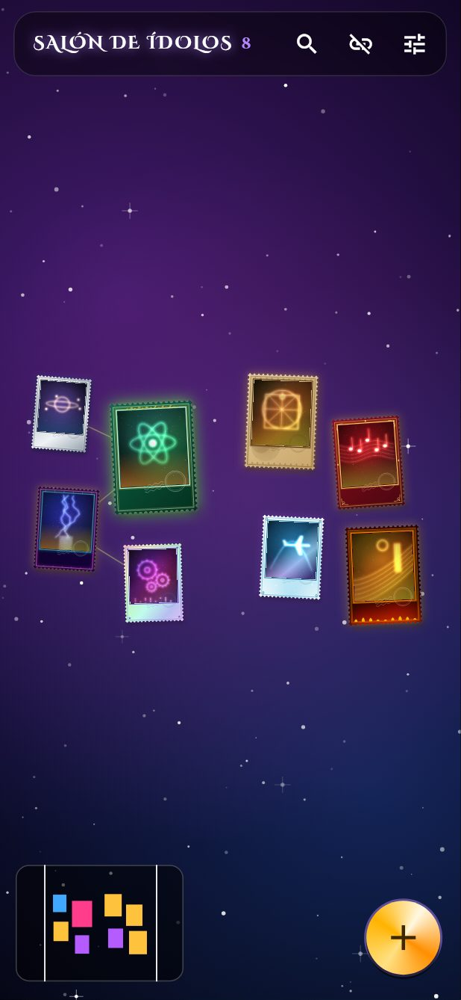
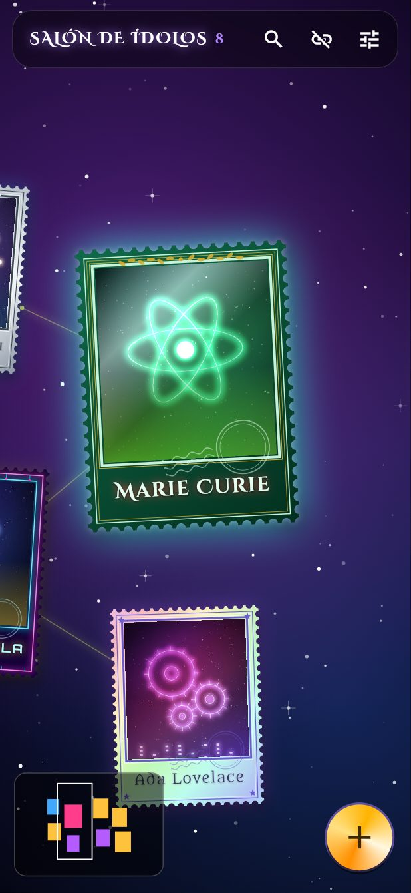
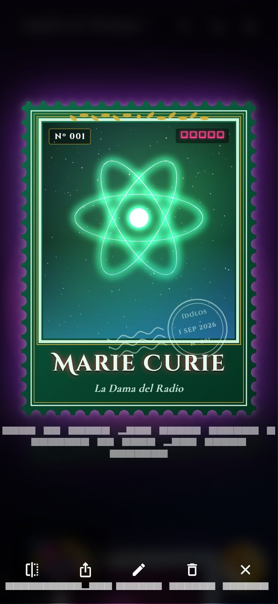
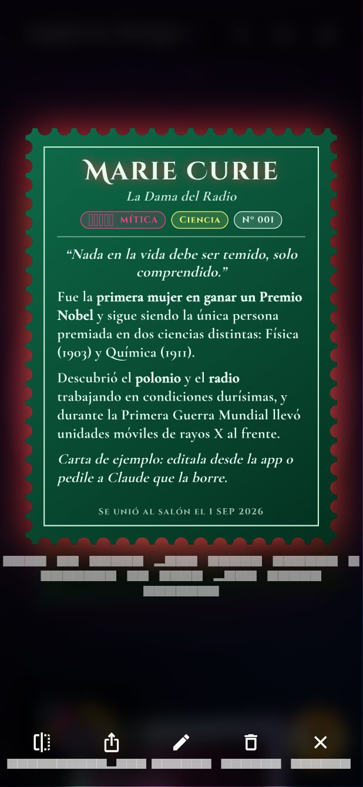
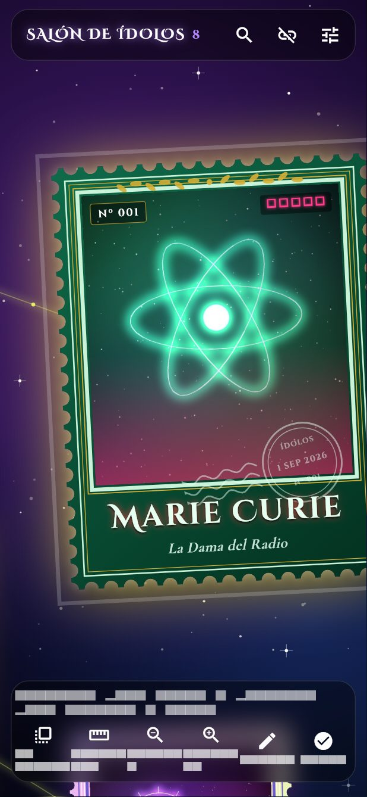
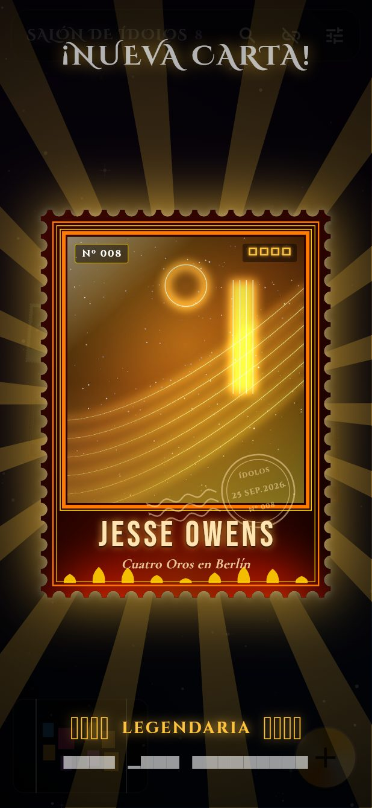
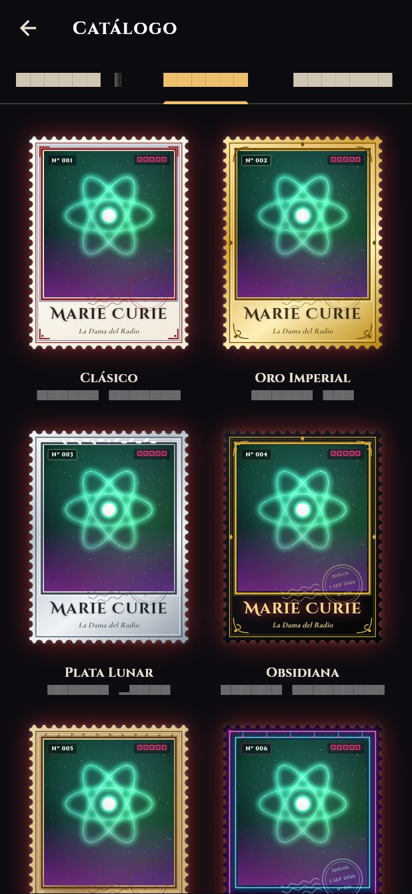
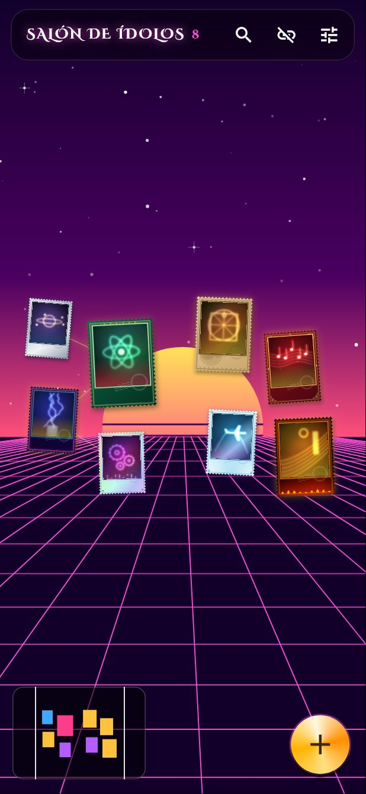
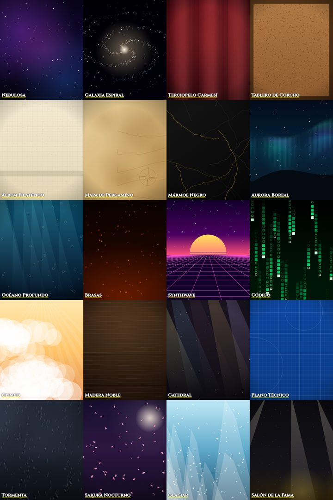

# Salón de Ídolos

Un tablero infinito de cartas-estampilla épicas con mis ídolos. App Android en
Flutter; los datos viven en este mismo repo, en `collection/`.

```
app/          ← código de la app (Flutter)
collection/   ← mis ídolos: imágenes + card.md + layout.json  (ver collection/README.md)
.github/      ← compila el APK automáticamente
```

## Qué hace

- **Tablero infinito**: arrastrá para moverte, pellizcá para hacer zoom. De lejos
  se ven cientos de cartas; al acercarte aparecen el nombre (con su fuente épica),
  el título, el número y el matasellos.
- **Tocar una carta**: la cámara vuela hasta ella y se abre en grande. Tocala
  para darla vuelta y leer por qué lo admirás. Deslizá el dedo o inclina el
  teléfono y brilla como una carta holográfica. Se puede compartir como imagen.
- **Mantener apretada**: la levantás y la movés. Mientras está seleccionada,
  pellizcá para agrandarla o rotarla. Las posiciones se guardan en el repo.
- **Botón +**: elegís una foto, nombre, título, categoría, rareza, uno de 12
  marcos, una de 21 fuentes, una frase y tu texto. Se sube sola al repo.
- **Rarezas** (Común → Mítica): cambian el color y la fuerza del brillo, el
  reflejo que cruza la carta y el holograma.
- **20 fondos** para el tablero (Ajustes → Fondo), con profundidad y animación.
- **Constelaciones**: las cartas de la misma categoría se unen con hilos de luz;
  de lejos se ve el nombre de cada zona.
- **Carta nueva**: si se agregó un ídolo al repo desde la última vez, al abrir
  la app se revela con animación de sobre de figuritas.
- **Ídolo del día**, **buscador** con filtros, **minimapa**, sonidos y vibración.
- **Funciona sin internet**: guarda una copia local y sube los cambios cuando
  vuelve la conexión.

## Instalar en Android

1. Cada vez que cambia el código en `main`, GitHub Actions compila el APK y lo
   publica en **Releases** (`/releases/latest` del repo). Desde el teléfono,
   con la sesión de GitHub iniciada, bajá `salon-de-idolos.apk` e instalalo
   (Android va a pedir permiso para instalar apps de origen desconocido).
2. **Actualizaciones:** la app busca versiones nuevas al abrirse (y en
   Ajustes → Buscar actualización) y las instala encima con un toque.
3. **Clave de firma fija (una sola vez).** Para que Android acepte instalar cada
   versión encima de la anterior, todas tienen que estar firmadas con la misma
   clave. No hay ningún archivo de clave en el repo: GitHub Actions la genera
   siempre igual a partir de una frase secreta tuya
   (`app/android/tools/make_keystore.py`). En GitHub → el repo → Settings →
   Secrets and variables → Actions → **New repository secret**:
   - Name: `ANDROID_SIGNING_SEED`
   - Secret: una frase larga que inventes (por ejemplo 6 o más palabras al
     azar). No hace falta recordarla, pero **no la cambies**: otra frase es
     otra clave, y habría que desinstalar la app para volver a instalarla.

## Versión web (iPhone / Safari)

La misma app compilada para web, publicada en GitHub Pages en cada cambio de
código: **https://brunogoat.github.io/Idol-collection/**

- En el iPhone: abrila en Safari → Compartir → **Agregar a pantalla de inicio**.
  Queda con ícono y a pantalla completa.
- La colección se guarda en el navegador (IndexedDB) y se sincroniza con el repo
  igual que en Android. El token queda guardado en ese navegador.
- Diferencias con Android: no hay actualizador (la web siempre está al día) y
  el holograma por inclinación puede no responder en iOS (deslizar el dedo sí).
- GitHub Pages en repos privados requiere GitHub Pro: con el repo público,
  activalo en Settings → Pages → Source: **GitHub Actions**.

## Conectar la app al repo

En la app: **Ajustes → Repositorio de GitHub**.

- Dueño `BrunoGoat`, repo `Idol-collection`, rama `main`.
- Token: GitHub → Settings → Developer settings → Personal access tokens →
  **Fine-grained tokens** → acceso *solo* a este repo, permiso
  **Contents: Read and write**. Se guarda cifrado en el teléfono.

## Agregar ídolos pidiéndoselo a Claude

Pedile, por ejemplo: *"agregá a Lionel Messi, rareza mítica, marco oro, fuente
Cinzel Decorative, categoría Deporte, y este texto…"* junto con la imagen.
Claude crea `collection/idols/<id>/card.md` + `image.jpg`, y la próxima vez que
abras la app aparece con la animación de carta nueva.

## Desarrollo

```bash
cd app
flutter pub get
flutter analyze && flutter test
SCREENSHOTS=1 flutter test test/screenshots_test.dart   # capturas en build/screenshots/
flutter run
```

## Capturas

| Tablero | Zoom | Carta | Reverso |
|---|---|---|---|
|  |  |  |  |

| Edición | Carta nueva | Marcos | Synthwave |
|---|---|---|---|
|  |  |  |  |

Los 20 fondos: 

> Las capturas salen de `test/screenshots_test.dart`: los textos de botones se
> ven como barras grises porque el entorno de test no tiene la fuente del sistema.
